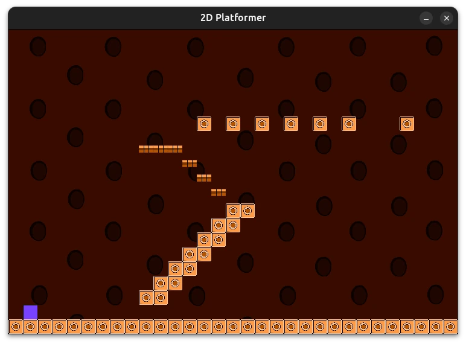

# minimal-2d-platformer-sdl2

## Gameplay


## About
A simple 2D palformer game written in C++ using SDL2.

## Dependencies
* gcc (GNU GCC Compiler)
	* build-essential (Debian and Ubuntu distros and its derivatives)
* libsdl2-dev
* libsdl2-mixer-dev
* libsdl2-image-dev
* cmake

## Manual Install (Ubuntu 22.04.2 LTS)
[manual_install_sdl2](./manual_install_sdl2.md)

## Building the project
Set up the build directory
```
cmake -DCMAKE_EXPORT_COMPILE_COMMANDS=1 -B build
```

Go to build directory
```
cd build
```

Compile the project
```
cmake --build .
```
